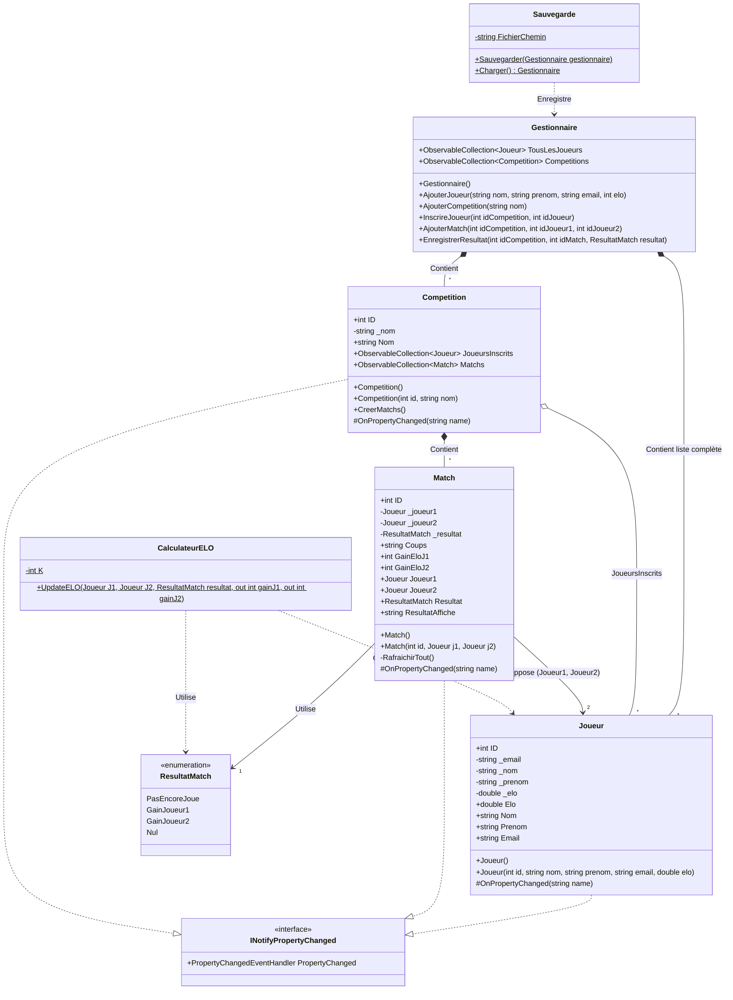
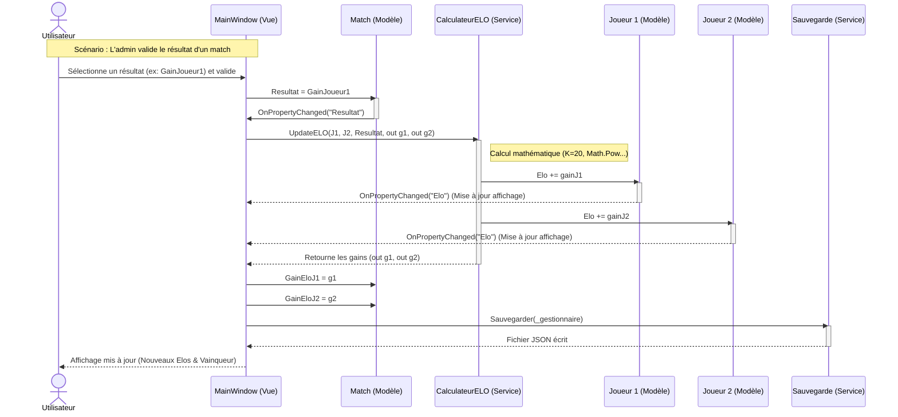
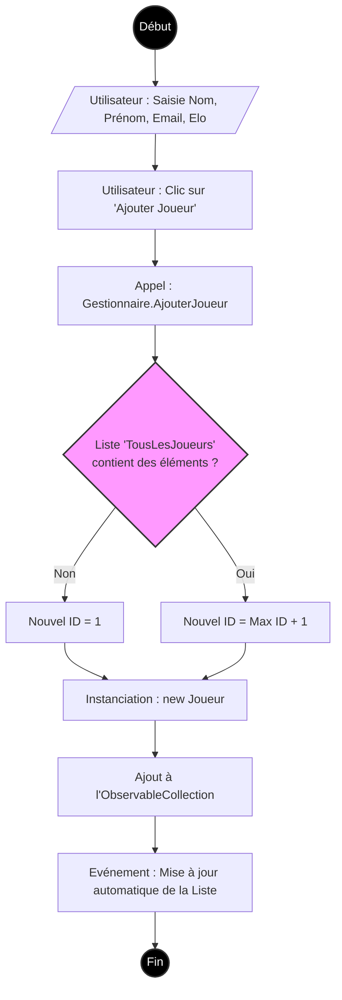

## Introduction :
ChessDB est une application de gestion des matchs d'une fédération d'échecs développée en C# et à l'aide du framework Avalonia UI. Elle est utile au personnel administratif devant encoder les noms/prénoms des participants, gérer les compétitions, noter les coups des joueurs, etc.

ChessDB est capable :
- De gérer les informations personnelles des joueurs (nom, prénom, mail, Elo)
- De créer des compétitions et y inscrire les joueurs dedans
- De modifier ou supprimer les informations précédentes si besoin
- De générer automatiquement la liste de matchs entre les joueurs 
- Pour chaque match y inscrire tous les coups des joueurs
- Pour chaque match noter le gagnant et calculer en conséquence automatiquement l'Elo des deux joueurs

## Fonctionnalité supplémentaire - Barre de recherche dynamique : 
La fonctionnalité supplémentaire de ChessDB est de pouvoir rechercher les joueurs inscrits sur l'applications de manière dynamique.
En tapant le nom/prénom de l'utilisateur que vous recherchez, la liste de joueurs se met à jour dès que vous appuyez sur votre clavier grâce à l'événement KeyUp d'Avalonia (en supplément de la méthode .Where(...) en LINQ qui filtrent les données directement en mémoire et non depuis le disque).
Méthode de recherche pratique par rapport à un simple bouton statique "Valider".

## Diagramme de classes :
Le diagramme de classes suivant correspond aux intéractions entre les modèles et les services du code.

## Diagramme de séquences :
Le diagramme de séquence suivant correspond à la validation d'un résultat de match et au calcul de l'Elo.

## Diagramme d'activités :
Le diagramme d'activité suivant correspond au processus de création et enregistrement d'un joueur.

## Qualités d'adaptabilité à une autre fédération :
ChessDB est facilement modulable à d'autres fédérations sportives tels que le tennis, le football, la boxe, etc. :

- De part son système de calcul de points (CalculateurELO.cs). Radicalement différent d'un sport à un autre, toute la logique du calcul de points d'échecs se trouve dans ce fichier. Ce qui veut dire que celui-ci peut être aisément modifié indépendamment du reste du code pour convenir à un autre sport.
- D'autre part sa structure des modèles de données commune à d'autres sports (Joueur, Match, Competition).
  - La classe Joueur par exemple contient les informations génériques d'un joueur en compétition (même Elo peut être considéré comme commun à d'autres sports étant donné qu'il s'agit uniquement d'un score de référence).
  - De plus la classe Match possède une propriété Coups qui est simplement un input en string : utilisé dans notre cas pour noter les coups des joueurs, il reste universel et peut être utilisé par exemple pour un Scrabble en notant le nombre de mots posés. Ou encore sa propriété RésultatMatch qui est lui aussi universel aux sports d'opposition (soit le Joueur1 gagne, soit le Joueur2, soit match nul).
- Et finalement par son système de sauvegarde qui n'enregistre pas manuellement des propriétés précises aux échecs mais plutôt sérialise l'objet Gestionnaire ainsi que ses références. Ce qui signifie que si l'on souhaite changer de sport et rajouter une catégorie poids (pour le MMA par exemple), le système de sauvegarde l'inculera dans son processus sans avoir besoin de modifier son code.

## Principes SOLID utilisés :
Pour garder une bonne maintenance de l'application, ChessDB respecte les principes SOLID. Voici en détail 3 de ces principes ci-dessous expliquées à l'aide de notre code :

- Single Responsability Principle (SRP) : Les classes et les méthodes ne doivent être responsables que d'une chose, cela permet d'avoir une grande cohésion. La logique métier, la persistance des données et les modèles de données sont strictement séparés dans ce code, avec chacune des classes ayant un rôle unique :
  - Comme la classe CalculateurELO qui est uniquement responsable du calcul des points. Si la formule mathématique du classement change seule cette classe sera modifiée.
  - Ou la classe Sauvegarde qui est uniquement responsable de l'écriture et de la lecture du fichier JSON. Elle ignore le rôle d'un "Match" ou d'un "Elo", elle se contente de sauvegarder ce qu'on lui demande.
  - Ou encore la classe Joueur qui ne sert qu'à contenir les données d'un joueur, elle ne contient aucune logique de sauvegarde ni de calcul.

    Cette séparation permet de modifier la façon dont on sauvegarde les données (passer de JSON à XML par exemple) sans risquer de casser le calcul des scores ou l'interface graphique.
    
- Open/Closed Principle (OCP) : Le code doit être ouvert aux extensions (ajout de fonctionnalités) (Open) mais le code doit être fermé aux modifications (pas de modifications du code déjà existant) (Closed) :
  - Comme à nouveau la classe Sauvegarde qui est ouvert à l'extension : comme dit précédemment, si une nouvelle fonctionnalité doit être ajoutée (dû à un changement de sport), la classe Sauvegarde le permettera sans pour autant modifier son code. Elle est donc fermée à la modification car elle n'en a pas besoin pour supporter de nouvelles fonctions.

    Ce respect de l'OCP garantit que l'ajout de nouvelles données métiers ne déstabilise pas les "fondations" de l'application, réduisant ainsi le risque de bugs.
    
- Dependency Inversion Principle (DIP) : Le projet doit dépendre uniquement de classes abstraites. Les modules de haut niveau (la logique métier/les données) ne doivent donc pas dépendre des modules de bas niveau (l'interface graphique) :
  - En analysant les dépendances (les "using" en haut des fichiers),  il est clair que les classes Modèles (Joueur, Match, Competition) sont totalement indépendantes de la librairie graphique Avalonia UI. La classe Joueur ne sait par exemple pas qu'elle est affichée dans une ListBox (axaml) ou qu'elle est utilisée dans Avalonia, étant donné qu'elle ne réfère aucun de ces éléments dans son code.

    Ce découpage est crucial pour la durabilité du projet. Dans le cas où une nouvelle UI doit être implémentée dans le futur, il n'y aura pas besoin de modifier le cœur du code étant donné qu'il est séparé de la partie interface graphique.

## Conclusion :
En conclusion, ce projet ChessDB correspond bien aux attentes du professeur et est prête à utilisation, malgré quelques changements qui auraient pu être appliqués, notamment le MainWindow.axaml.cs qui contient toutes les fonctions liées à l'affichage les unes après les autres.
Cependant j'estime que mon application peut être modifiée pour des féderations sportives autre que les échecs.

## Auteur :
Chouaa Mohamed - 23105
